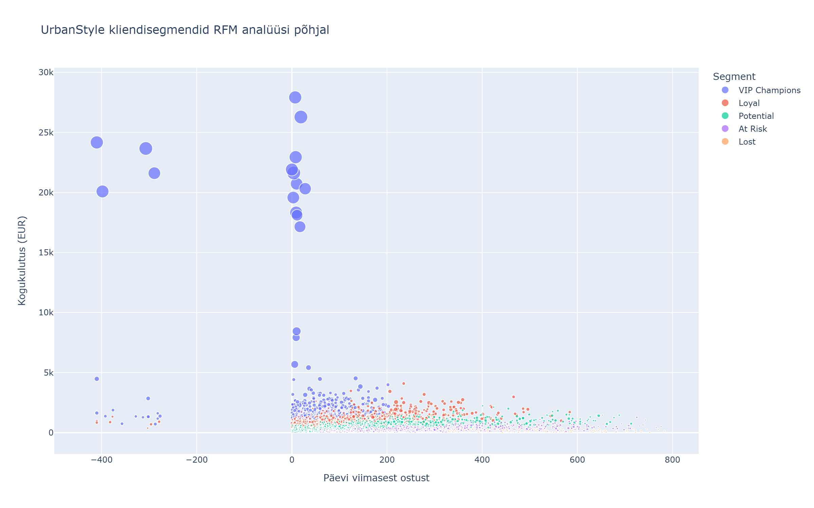
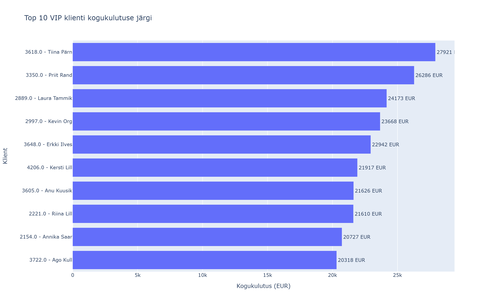

# UrbanStyle RFM Andmepuhastus Pythonis

English version: [README_EN.md](README_EN.md)

## Äriprobleem

UrbanStyle vajas usaldusväärset kliendisegmenteerimist, kuid RFM analüüs annab häid tulemusi ainult siis, kui sisendandmed on puhtad. Minu ülesanne oli tagada, et müügi- ja kliendiandmed sobiksid Recency, Frequency ja Monetary arvutamiseks.

## Lähenemine

Tegin Roll B ehk andmete puhastamise. Võtsin Roll A liidetud müügi- ja kliendiandmete DataFrame'i, eemaldasin duplikaadid, käsitlesin kriitilised NULL väärtused, parsisin kuupäevad ning eemaldasin vigased või mittepositiivsed `total_price` väärtused.

## Peamised leiud

- Puhastuse käigus on kõige olulisem kaitsta RFM analüüsi sisendit: `customer_id`, `sale_date` ja `total_price` ei tohi olla tühjad, sest nendest arvutatakse Recency, Frequency ja Monetary väärtused.
- Supabase andmetel jäi pärast puhastust alles 8,950 müügirida ja 2,540 unikaalset klienti.
- VIP Champions segment annab suurima osa käibest, kuigi see ei ole kõige suurem kliendigrupp.

## Tehniline pinurida

- Python
- Pandas
- Jupyter Notebook
- Supabase andmed

## Ekraanipildid

Tiimitöö RFM väljundid:

## Failid

- `individual/week7_rfm_B.ipynb` - minu individuaalne Roll B notebook.
- `team/week7_rfm_complete.ipynb` - terviklik tiimitöö notebook rollidega A, B, C ja D.
- `team/rfm_segments.csv` - eksporditud kliendisegmendid.

## Kuidas käivitada

1. Ava `individual/week7_rfm_B.ipynb` Jupyteris või VS Code'is.
2. Veendu, et Python keskkonnas on vajalikud andmetöötluse paketid olemas.
3. Käivita notebook sammude kaupa ja kontrolli puhastuse raportit enne RFM arvutust.

## Õpitu ja väljakutsed

Suurim väljakutse oli mõista, millised vead rikuvad RFM analüüsi kõige rohkem. Õppisin, et andmepuhastus ei ole tehniline kõrvaltegevus, vaid analüüsi usaldusväärsuse alus.

## AI kasutamine

Kasutasin AI abi juhendi tõlgendamiseks, Roll B puhastusvoo koostamiseks ja tiimitöö notebooki Supabase-põhiseks muutmiseks. AI aitas lisada kontrollid, raportid ja ekspordi, kuid andmepuhastuse loogika ja lõplikud otsused kontrollisin ise.
